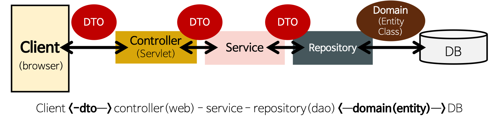

# dto란 무엇일까?

- **계층간 데이터 교환이 이루어 질 수 있도록 하는 객체**
- 로직 X, getter, setter만 **有**
- 예) 유저가 입력한 데이터를 DB에 넣는 과정
    - 유저가 자신의 브라우저에서 데이터를 입력하여 form에 있는 데이터를 DTO에 넣어서 전송
    - 해당 DTO를 받은 서버가 DAO를 이용하여 데이터베이스로 데이터를 집어넣음
- 필드에 객체 여부
    - 안됨
    - having only public fields limited to the easily serializable types:
    - The *Types* that can be used in DTOs is limited to:
        - Primitive types
        - Wrapper classes for the primitive types
        - String
        - enum
        - Version
        - Data Transfer Objects
        - List
        - Set
        - Map
        - array
    - ref
        - [https://www.baeldung.com/java-dto-pattern](https://www.baeldung.com/java-dto-pattern)
        - [https://enroute.osgi.org/FAQ/420-dtos.html](https://enroute.osgi.org/FAQ/420-dtos.html)